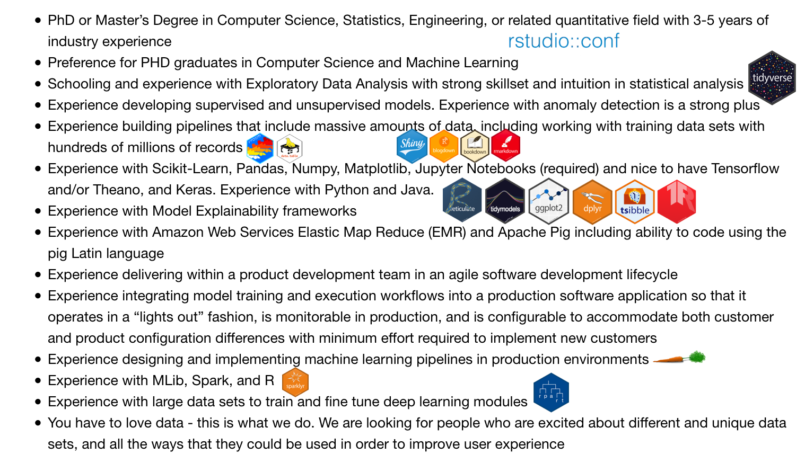
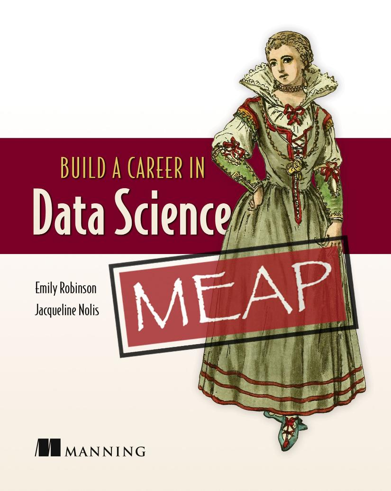
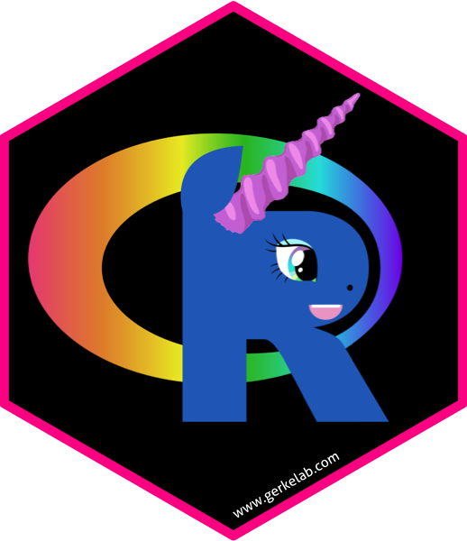

```{r setup, include=FALSE}
options(htmltools.dir.version = FALSE)

knitr::opts_chunk$set(
  fig.width = 10, fig.height = 6, fig.retina = 2,
  warning = FALSE, message = FALSE
)

library(tidyverse)

xaringanExtra::use_xaringan_extra(c("animate_css", "text_poster"))
```

class: center middle hide-count hide-logo
background-image: url(figures/moffittlogo.png)
background-size: 22%
background-position: bottom 5% right 5%

<div class="talk-logo swivel-horizontal"></div>

<!--.talk-title[
.talk-title-main.moffitt-blue[UnicoRns are real]
]-->

.talk-meta[
  .talk-author[Travis Gerke, ScD]
  
  <!-- https://fontawesome.com/license -->
  .talk-date[ @travisgerke]
  
  .talk-auth2[w/ Donna C. Evans] <!--Senior Compensation Consultant-->
]

---
class: center inverse strive-to-recruit

`r xaringanExtra::text_poster(
  "I strive to recruit the 
  most talented 
  data scientists and
  compensate them accordingly.",
  width = "90%",
  height = "85%"
)`

.footnote.pull-right.moffitt-grey[— _Every good data science manager ever_]

```{css echo=FALSE}
@import url('https://fonts.googleapis.com/css?family=Merriweather:300');

.text-poster {
	font-family: 'Merriweather', serif;
  margin: 0 auto;
}
.strive-to-recruit .text-poster .line-container .line:nth-child(2) {
  color: #82c878;
}
.strive-to-recruit {
  background: #00589a;
}
```

---

### Parody?

.w-50.h-center[

]

---
class: inverse hide-count
background-image: url('figures/enemy.gif')
background-size: cover

# Truth?

---

### Is there another way?

.pull-left[
.center[

HR can't do a market salary benchmark analysis for a person that doesn't exist
]
]

--

.pull-right[
.v-center[

]
]
<!-- credit to vectorstock.com/22698768 -->

---
layout: true
class: job-posting animated fadeIn

### Data Scientist wanted! (1/2)

Seeking data scientists with hands on experience transforming unique data into amazing products. You will have access to an enormous amount of high-value business activity data. You will participate in the end-to-end processes of product development using .one[machine learning], from proof of concept to .two[deploying models in production]. Your work will directly impact the developer experience in .three[building applications], as well as the customer experience when interacting with them.

* Working closely with Software Engineers and Product/Technical Services Mangers to drive analysis and performance improvements
* .four[Developing and implementing cloud-based security solutions] providing data protection and governance, and improving customer experience
* Working with internal business teams to .five[integrate data and decision-making]
* Build intelligence into our services to make them run smarter with a responsible application of Machine Learning.

---
class: full 

---
class: job-posting-one

---
class: job-posting-two

---
class: job-posting-three

---
class: job-posting-four

---
class: job-posting-five

---
layout: false

### Data Scientist wanted! (2/2)

.w-85.h-center[

]

---

### Data Scientist wanted! (2/2)

.w-85.h-center[

]

---

### Challenge: job descriptions that map to appropriate salaries

.pull-left[
> A common listing describes a unicorn...

> These types of job descriptions usually mean the company doesn’t know what they’re looking for, and they expect a data scientist to come and solve all their problems without any support.

.w-25.h-center[

]
]

--

.pull-right[
But unicoRns are real and should be compensated as such!

.w-50.h-center[

]
]

---

### The job description to offer pipeline

Hiring manager writes a job description
* States the primary purpose, expected deliverables
* Requirements for technical skills, prior experience, and/or education

--

HR benchmarks a market price using the following criteria
* Hourly or salary
* Type of contributor: technician, professional, scientist
* Level of contributor: entry, intermediate, senior, principal

--

Benchmarking data are from purchased compensation surveys that require licensure
* HR will aggregate across several such sources to derive a salary range
* The ultimate offer varies somewhat by company's compensation philosophy

---

```{r, echo=FALSE}
library(tidyverse)

dat <- read_csv(here::here("data", "data-scientist-salaries.csv"))

dat %>% 
   filter(!grepl("Tampa", Geography)) %>% 
   ggplot(aes(x = `Job Title`)) + 
   geom_boxplot(aes(fill = Geography, 
                    ymin = Q1, lower = Q1, middle = Median, upper = Q3, ymax = Q3), 
                stat = "identity", color = "white") + 
   grkmisc::theme_moffitt() +
   grkmisc::scale_fill_moffitt() +
   coord_flip() +
   labs(x = NULL, y = "Annual salary") +
   scale_y_continuous(labels = scales::dollar_format(suffix = "k")) + 
   theme(legend.position = "bottom")
```

```{css, echo=FALSE}
.talk-logo {
  width: 480px;
  height: 556px;
  position: absolute;
  top: 5%;
  left: calc(50% - 240px);
  background-image: url('figures/unicorn_hex_title.png');
  background-size: cover;
  background-repeat: no-repeat;
}
.talk-title {
  font-family: Overpass;
}
.talk-title .talk-title-main {
  font-size: 2.3em;
  font-weight: bold;
  position: absolute;
  top: 55%;
  left: 0;
  width: 100%;
}
.talk-title .talk-title-sub {
  font-size: 1.28em;
  position: absolute;
  top: 66%;
  width: 100%;
  left: 0;
}
.talk-meta {
  font-family: Overpass;
  position: absolute;
  text-align: left;
  bottom: 25px;
  left: 35px;
}
.talk-meta p {
	margin-top: 0.25em;
	margin-bottom: 0.25em;
}
.talk-title {
  margin-bottom: 5em;
  text-align: center;
}
.talk-author {
  color: #444;
  font-weight: bold;
  font-size: 1.5em;
  line-height: 1em;
  margin-bottom: 0;
}
.talk-date {
  color: #666;
  font-size: 1.25em;
  line-height: 0;
  margin-top: 0;
}
.talk-auth2 {
  color: #666;
  font-size: 1em;
  line-height: 0;
  margin-top: 0;
}

.hide-count .remark-slide-number {
  display: none;
}

@keyframes swivel-horizontal {
  0% {
    transform: rotateY(0);
  }
  50% {
    transform: rotateY(360deg);
  }
  100% {
    transform: rotateY(360deg);
  }
}

.remark-visible .swivel-horizontal {
  animation-name: swivel-horizontal;
  animation-duration: 5s;
  animation-timing-function: linear;
  animation-iteration-count: infinite;
}

.w-25 {
  width: 25%;
}
.w-50 {
  width: 50%;
}
.w-85 {
  width: 85%;
}
.h-center {
  margin: 0 auto;
}
.v-center {
  display: flex;
  justify-content: center;
  align-items: center;
}

.job-posting:not(.full) {
  color: #aaa;
}

.job-posting-one .one,
.job-posting-two .two,
.job-posting-three .three,
.job-posting-four .four,
.job-posting-five .five {
  color: #eb1455;
}

```

